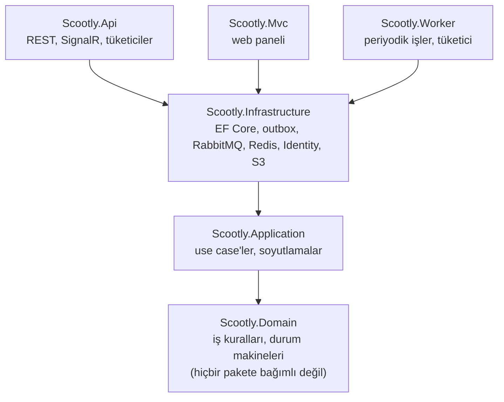
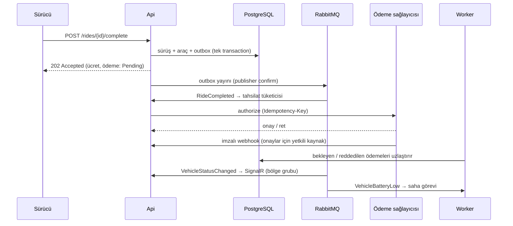

# Scootly

**Şehir içi elektrikli scooter paylaşım platformu: REST API, filo yönetim paneli ve arka plan işleri.**
.NET 10 ile, Clean Architecture prensipleriyle geliştirilmiş bir öğrenme/portföy projesidir.

Sürücü yakınındaki müsait scooter'ı bulur, rezerve eder, sürüşe başlar ve bitirir; ücret tarifeyle hesaplanıp ödeme
sağlayıcısından asenkron tahsil edilir. Cihazlar konum ve batarya gönderir; bataryası düşen araç için saha ekibine
otomatik görev açılır. Filo ekibi araçları, canlı haritayı ve saha görevlerini web panelinden yönetir.

> Son sürüm `v0.1.0-rc.1` (6 Ekim 2026). Sonrasındaki değişiklikler `CHANGELOG.md` → `[Unreleased]` bölümündedir.

---

## İçindekiler

- [Öne Çıkanlar](#öne-çıkanlar)
- [Hızlı Başlangıç (Docker)](#hızlı-başlangıç-docker)
- [Yerel Geliştirme (dotnet run)](#yerel-geliştirme-dotnet-run)
- [İlk Giriş ve Roller](#ilk-giriş-ve-roller)
- [Mimari](#mimari)
- [Servisler ve Portlar](#servisler-ve-portlar)
- [API Uçları](#api-uçları)
- [Web Paneli (Mvc)](#web-paneli-mvc)
- [Güvenlik ve Gizlilik](#güvenlik-ve-gizlilik)
- [Testler](#testler)
- [CI/CD](#cicd)
- [Proje Yapısı](#proje-yapısı)
- [Dokümantasyon ve Mimari Kararlar](#dokümantasyon-ve-mimari-kararlar)

---

## Öne Çıkanlar

| Alan | Ne yapıyor? |
|---|---|
| **Sürüş akışı** | Rezervasyon (10 dk) → sürüş → bitiş. Durum makinesi + veritabanı kısıtları: sürücü başına tek rezervasyon ve tek aktif sürüş, araç başına tek aktif sürüş. %10'un altında bataryalı araç kiralanamaz. |
| **Eşzamanlılık** | PostgreSQL `xmin` ile iyimser kilitleme; çakışmada taze veriyle otomatik yeniden deneme. 50 eşzamanlı rezervasyondan yalnızca biri kazanır. |
| **Ödeme saga'sı** | Outbox → RabbitMQ → ödeme sağlayıcısı. Idempotency anahtarı, HMAC imzalı webhook ve uzlaştırma işiyle çift tahsilat ve kayıp önlenir. |
| **Güvenilir mesajlaşma** | Domain olayları aynı transaction'da outbox'a yazılır; publisher confirm, gecikmeli retry kuyruğu, DLQ, idempotent tüketiciler. Broker kesintisinden sonra tüketiciler kendiliğinden toparlanır. |
| **Telemetri** | Cihaz ağ geçidinden toplu konum/batarya; sınırlı bellek içi kuyruk, doluysa 503 + `Retry-After`. Batarya eşiği aşılınca saha görevi açılır; kaçan olayları bir tarama işi tamamlar. |
| **Saha operasyonu** | Görev üstlenme/tamamlama, isteğe bağlı fotoğraf (JPEG/PNG, 5 MB, S3 uyumlu depo), bakım/kayıp/hizmete dönüş işlemleri. |
| **Canlı harita** | SignalR ile hizmet bölgesine göre gruplanmış araç durumu bildirimleri; bölge çözümleme poligon (ray casting) ile. |
| **Kimlik** | Identity + JWT (API), cookie (panel). Rol ve kaynak sahipliği bazlı yetki, hesap kilitleme, rol/parola değişince token iptali, KVKK hesap silme. |
| **İşletme** | Docker imajları, üretim Compose'u (Nginx + TLS, 2 replika), mavi-yeşil dağıtım iskeleti, sağlık kontrolleri, Serilog/Seq, OpenTelemetry/Jaeger, Prometheus/Grafana. |

---

## Hızlı Başlangıç (Docker)

Tüm uygulamayı (veritabanı, mesaj kuyruğu, Api, Worker, panel, ödeme simülatörü) tek komutla açmanın yolu.

**Gerekenler:** Docker Desktop (çalışır durumda).

```powershell
cd deploy
Copy-Item .env.example .env      # yalnızca ilk kez; sonra .env içindeki boş/"degistir" değerleri doldurun
docker compose --profile app up -d --build
```

`.env` içindeki değerler için güçlü rastgele değer üretmek:

```powershell
[Convert]::ToHexString([Security.Cryptography.RandomNumberGenerator]::GetBytes(32))
```

Doldurulması zorunlu alanlar: `POSTGRES_PASSWORD`, `APP_DB_PASSWORD`, `RABBITMQ_PASSWORD`, `REDIS_PASSWORD`, `JWT_KEY`,
`JWT_HUB_KEY`, `DEVICE_CLIENT_SECRET`, `PAYMENT_WEBHOOK_SECRET`, `GRAFANA_ADMIN_PASSWORD` (anahtarlar en az 32 karakter).
İlk yönetici hesabı için `BOOTSTRAP_FLEET_MANAGER_EMAIL` ve `BOOTSTRAP_FLEET_MANAGER_PASSWORD` de doldurulmalı
(bkz. [İlk Giriş ve Roller](#ilk-giriş-ve-roller)). Eksik bir değer varsa Compose hangi değişkenin eksik olduğunu yazarak durur.

Açılış sırası otomatiktir: altyapı sağlıklı olur → `migrator` şemayı uygular → `db-init` uygulama veritabanı rolünü
hazırlar → Api, Worker ve panel başlar.

| Adres | Ne var? |
|---|---|
| http://127.0.0.1:5096 | Web paneli (Mvc) |
| http://127.0.0.1:5016 | REST API (`/health/ready` ile hazırlık kontrolü) |
| http://127.0.0.1:15672 | RabbitMQ yönetim arayüzü (`RABBITMQ_USER` / `RABBITMQ_PASSWORD`) |

Araçlara hareket ve batarya verisi göndermek için cihaz simülatörünü ayrıca çalıştırın
(bkz. [Yerel Geliştirme](#yerel-geliştirme-dotnet-run), adım 4). Durdurmak için `docker compose --profile app stop`
yeterlidir; veriler volume'larda kalır.

İsteğe bağlı profiller:

```powershell
docker compose --profile observability up -d     # Seq 5341, Jaeger 16686, Prometheus 9090, Grafana 3001
docker compose --profile storage up -d seaweedfs  # fotoğraf yükleme için S3 uyumlu depo (+ .env: STORAGE_ENABLED=true)
```

Üretim benzeri yığın (Nginx + TLS, 2 Api ve 2 panel kopyası, tek giriş `https://127.0.0.1:8443`):

```powershell
docker compose -p scootly-prod --env-file .env.prod -f docker-compose.yml -f docker-compose.prod.yml --profile app up -d --build
```

Geliştirme ve üretim yığınları aynı sabit konteyner adlarını kullandığı için aynı anda çalışmaz: birini açmadan önce
diğerini `down` ile kapatın (`-v` vermeyin; veriler kalır).

---

## Yerel Geliştirme (dotnet run)

Kodu değiştirip hızlı denemek için: altyapı Docker'da, uygulamalar `dotnet run` ile.

**Gerekenler:** .NET 10 SDK, Docker Desktop, EF Core aracı (`dotnet tool install --global dotnet-ef`).

**1. Altyapıyı başlat** (PostgreSQL, Redis, RabbitMQ; yalnızca 127.0.0.1'e açılır):

```powershell
cd deploy
docker compose up -d
cd ..
```

**2. Sırları user-secrets'a ekle** (ilk kez; değerler `deploy/.env` ile aynı olmalı). Hiçbir sır kaynak kodda tutulmaz.

```powershell
$db = "Host=localhost;Port=5432;Database=scootly;Username=postgres;Password=<POSTGRES_PASSWORD>"

# Api
dotnet user-secrets set "ConnectionStrings:DefaultConnection" $db --project src/Scootly.Api
dotnet user-secrets set "Jwt:Key" "<JWT_KEY>" --project src/Scootly.Api
dotnet user-secrets set "Jwt:HubKey" "<JWT_HUB_KEY>" --project src/Scootly.Api
dotnet user-secrets set "DeviceAuth:ClientSecret" "<DEVICE_CLIENT_SECRET>" --project src/Scootly.Api
dotnet user-secrets set "PaymentWebhook:Secret" "<PAYMENT_WEBHOOK_SECRET>" --project src/Scootly.Api
dotnet user-secrets set "RabbitMq:Password" "<RABBITMQ_PASSWORD>" --project src/Scootly.Api
dotnet user-secrets set "Redis:ConnectionString" "localhost:6379,password=<REDIS_PASSWORD>" --project src/Scootly.Api
dotnet user-secrets set "Bootstrap:FleetManagerEmail" "yonetici@ornek.com" --project src/Scootly.Api
dotnet user-secrets set "Bootstrap:FleetManagerPassword" "<güçlü parola>" --project src/Scootly.Api

# Worker
dotnet user-secrets set "ConnectionStrings:DefaultConnection" $db --project src/Scootly.Worker
dotnet user-secrets set "RabbitMq:Password" "<RABBITMQ_PASSWORD>" --project src/Scootly.Worker
dotnet user-secrets set "Redis:ConnectionString" "localhost:6379,password=<REDIS_PASSWORD>" --project src/Scootly.Worker

# Web paneli (yalnızca hub anahtarını bilir, JWT_KEY'i bilmez)
dotnet user-secrets set "ConnectionStrings:DefaultConnection" $db --project src/Scootly.Mvc
dotnet user-secrets set "Jwt:HubKey" "<JWT_HUB_KEY>" --project src/Scootly.Mvc

# Simülatörler
dotnet user-secrets set "Webhook:Secret" "<PAYMENT_WEBHOOK_SECRET>" --project src/Scootly.PaymentSimulator
dotnet user-secrets set "ClientSecret" "<DEVICE_CLIENT_SECRET>" --project src/Scootly.DeviceSimulator
```

**3. Veritabanı şemasını uygula** (ilk kez ve her yeni migration'dan sonra):

```powershell
dotnet ef database update --project src/Scootly.Infrastructure --startup-project src/Scootly.Api
```

**4. Uygulamaları ayrı terminallerde çalıştır** (bu sırayla):

| # | Komut | Adres / görev |
|---|---|---|
| 1 | `dotnet run --project src/Scootly.PaymentSimulator` | http://localhost:5094 — ödeme sağlayıcısı |
| 2 | `dotnet run --project src/Scootly.Api` | http://localhost:5016 — API, Swagger: `/swagger` |
| 3 | `dotnet run --project src/Scootly.Worker` | arka plan işleri |
| 4 | `dotnet run --project src/Scootly.Mvc` | http://localhost:5096 — web paneli |
| 5 | `dotnet run --project src/Scootly.DeviceSimulator` | kayıtlı araçlara telemetri gönderir (en az bir araç olmalı) |

Eksik veya kısa bir ayar varsa uygulama açılışta hangi ayarın eksik olduğunu yazarak durur.

---

## İlk Giriş ve Roller

| Rol | Kim? | Nasıl oluşur? |
|---|---|---|
| `FleetManager` | Filo yöneticisi: araç kaydı, rol yönetimi, her şey | `Bootstrap:FleetManagerEmail/Password` ayarlıysa Api açılışında **bu e-postayla hesap yoksa** oluşturulur. Var olan bir hesaba asla yetki verilmez. |
| `FieldOperator` | Saha ekibi: görevler, bakım/kayıp/hizmete dönüş | Yönetici rol atar: `POST /api/v1/admin/users/{id}/roles/FieldOperator` |
| `Driver` | Sürücü: rezervasyon, sürüş, kendi geçmişi | `POST /api/auth/register` ile kayıt olan herkes |

Parolalar yalnızca geri döndürülemez özet olarak saklanır; unutulan parola okunamaz. Parola kuralı: en az 8 karakter,
büyük harf, küçük harf ve rakam. 5 hatalı denemede hesap 15 dakika kilitlenir.

Örnek istekler (kayıt, giriş, rezervasyon, sürüş, hesap işlemleri) `src/Scootly.Api/Scootly.Api.http` dosyasındadır;
Visual Studio / VS Code / Rider içinden doğrudan çalıştırılabilir.

---

## Mimari

Bağımlılık oku her zaman içe, Domain'e doğrudur; mimari testler bunu her derlemede denetler.



| Proje | Sorumluluk |
|---|---|
| **Domain** | Araç ve sürüş durum makineleri, tarife, batarya ve konum değer nesneleri, saha görevi, domain olayları. |
| **Application** | Komut handler'ları, iyimser eşzamanlılık disiplini, soyutlamalar (repository, saat, ödeme, bölge, dosya depolama). EF Core'a bağımlı değil. |
| **Infrastructure** | EF Core/PostgreSQL, outbox ve RabbitMQ, Redis, Identity/JWT, ödeme istemcisi (Polly), S3 depolama, sağlık kontrolleri. |
| **Api** | HTTP uçları, politikalar, rate limiting, ProblemDetails, SignalR hub, ödeme ve bildirim tüketicileri, telemetri kuyruğu. |
| **Mvc** | Cookie girişli filo paneli. Api'ye bağlı değildir; Application ve Infrastructure'ı doğrudan kullanır. |
| **Worker** | Rezervasyon süresi, terk edilmiş sürüş, bekleyen ödeme, batarya uzlaştırması, veri saklama; batarya olayı tüketicisi. |
| **PaymentSimulator / DeviceSimulator** | Dış ödeme sağlayıcısını (imzalı webhook) ve cihaz ağ geçidini taklit eder. |

Ödeme ve bildirim akışı:



Gerekçeler `docs/adr/` içinde; sistem tasarımı ve bulut eşleştirmesi `docs/architecture/system-design.md`'de.

**Teknolojiler:** .NET 10, ASP.NET Core, EF Core 10 + Npgsql, PostgreSQL 16, RabbitMQ 3.13, Redis 7.4, SignalR,
Polly (Microsoft.Extensions.Http.Resilience), Serilog, OpenTelemetry, SeaweedFS (S3 API), Nginx 1.27, xUnit v3,
Testcontainers, NetArchTest, Playwright, k6. Paket sürümleri merkezi olarak `Directory.Packages.props`'ta yönetilir.

---

## Servisler ve Portlar

`deploy/docker-compose.yml` (tüm portlar yalnızca `127.0.0.1`'e açılır):

| Profil | Servis | Port | Not |
|---|---|---|---|
| (varsayılan) | postgres | 5432 | PostgreSQL 16 |
| (varsayılan) | redis | 6379 | Parolalı. Önbellek ve panel kopyalarının ortak anahtarları; erişilemezse Api önbelleksiz devam eder |
| (varsayılan) | rabbitmq | 5672, 15672 | AMQP ve yönetim arayüzü |
| `app` | migrator | — | Bekleyen migration'ları uygular ve çıkar |
| `app` | db-init | — | `scootly_app` rolünü oluşturur/günceller ve çıkar |
| `app` | payment-simulator | 5094 | Ödeme sağlayıcısı simülatörü |
| `app` | api | 5016 | REST API ve SignalR |
| `app` | mvc | 5096 | Web paneli |
| `app` | worker | — | Sağlık durumu heartbeat dosyasıyla izlenir |
| `storage` | seaweedfs | 8333 | S3 API (isteğe bağlı) |
| `observability` | seq, jaeger, otel-collector, prometheus, grafana | 5341, 16686, 4317/4318, 9090, 3001 | Gözlemlenebilirlik |
| `experiments` | redpanda | 9092 | Yalnızca Kafka karşılaştırma deneyi |

Sağlık uçları: `GET /health/live` (süreç ayakta mı) ve `GET /health/ready` (PostgreSQL, Redis, RabbitMQ).

---

## API Uçları

Hatalar RFC 7807 ProblemDetails biçiminde döner; Development ortamında tüm şemalar `/swagger`'dadır.

| Uç | Açıklama | Yetki |
|---|---|---|
| `POST /api/auth/register` | Kayıt (Driver rolü) | Herkese açık, IP başına 10/dk |
| `POST /api/auth/login` | Giriş, JWT döner | Herkese açık, IP başına 10/dk |
| `POST /api/device-auth/token` | Cihaz ağ geçidi token'ı | Herkese açık, IP başına 10/dk |
| `GET /api/account` | Hesabım (kimlik, e-posta, roller) | Oturum açmış kullanıcı |
| `POST /api/account/change-password` | Parola değiştir; eski token'lar iptal, yanıtta yeni token | Oturum açmış kullanıcı |
| `DELETE /api/account` | Hesabı sil (parolayla onaylı; konumlar anonimleşir) | Oturum açmış kullanıcı |
| `GET /api/v1/vehicles` | Araç listesi (alan filtresi, sayfalı, önbellekli) | Herkese açık\* |
| `GET /api/v2/vehicles` | Aynı liste, marka ve menzil bilgisiyle | Herkese açık\* |
| `GET /api/v1/vehicles/{id}` | Araç ayrıntısı | Herkese açık\* |
| `POST /api/v1/vehicles` | Araç kaydı | FleetManager |
| `POST /api/v1/vehicles/{id}/reserve` | Rezervasyon (10 dk) | Driver |
| `DELETE /api/v1/vehicles/{id}/reservation` | Kendi rezervasyonunu iptal | Driver |
| `POST /api/v1/vehicles/{id}/maintenance` · `/lost` · `/return-to-service` | Bakıma al · kayıp işaretle · hizmete döndür | FleetManager / FieldOperator |
| `POST /api/rides/start` | Sürüş başlat (201 + rideId) | Driver (rezervasyon sahibi) |
| `POST /api/rides/{id}/complete` | Sürüş bitir (202; ödeme asenkron) | Sürüş sahibi |
| `GET /api/rides` | Sürüş geçmişim (sayfalı) | Driver |
| `GET /api/rides/active` · `/{id}` · `/{id}/payment-status` | Aktif sürüş · ayrıntı · ödeme durumu | Sürüş sahibi |
| `POST /api/telemetry/batch` | Toplu telemetri (en fazla 500 okuma) | Cihaz |
| `POST /api/webhooks/payment-callback` | Ödeme sağlayıcısı bildirimi | HMAC imzası |
| `GET` · `POST /api/v1/service-areas` | Hizmet bölgeleri | Okuma herkese açık · oluşturma FleetManager |
| `POST` · `DELETE /api/v1/admin/users/{id}/roles/{rol}` | Rol yönetimi | FleetManager |
| `/hubs/fleet` | SignalR canlı araç durumu | Oturum açmış kullanıcı veya panelin hub token'ı |

\* Anonim kullanıcılar ve sürücüler yalnızca **müsait** araçları görür. Rezerve, sürüşteki, bakımdaki ve kayıp araçları
filo ekibi ve cihaz ağ geçidi görür; sürücü kendi rezerve ettiği ya da sürdüğü aracın ayrıntısını görebilir.

---

## Web Paneli (Mvc)

| Sayfa | Kim görür? | Ne yapılır? |
|---|---|---|
| Panel | Herkes (rolüne göre) | Filo ekibi: aktif sürüşler ve düşük bataryalı araçlar. Sürücü: harita ve sürüşlerim kısayolları. |
| Harita | Oturum açmış herkes | Canlı araç haritası. Filo ekibi tüm araçları, sürücü yalnızca müsaitleri görür. |
| Araçlar | FleetManager, FieldOperator | Liste; bakıma al, kayıp işaretle, hizmete döndür. Yönetici ayrıca araç ekler ve düzenler. |
| Görevler | FleetManager, FieldOperator | Açık saha görevlerini üstlen, tamamla (isteğe bağlı fotoğraf), tamamlananların fotoğrafını aç. |
| Sürüşlerim | Driver | Aktif sürüşler. |

Terk edilen bir sürüşten sonra araç bakıma alınır ve bir denetim görevi açılır. Görev tamamlanınca araç, Araçlar
sayfasındaki **Hizmete döndür** ile yeniden kiralanabilir hale gelir.

---

## Güvenlik ve Gizlilik

- **Sırlar** kaynak kodda değil; user-secrets veya `deploy/.env` (git'e girmez). Eksik/kısa ayar açılışta hatayla durur.
  Git geçmişindeki eski değerler 27.09.2026'da yenilendi ve geçersiz (ADR 0021, postmortem).
- **Token'lar:** kullanıcı token'ı Identity güvenlik damgasını taşır; rol değişikliği, parola değişikliği veya hesap silme
  eski token'ları geçersiz kılar. Panelin harita için ürettiği token ayrı anahtarla imzalanır, rol taşımaz ve yalnızca
  hub'da geçerlidir; panel ana API anahtarını bilmez (ADR 0046).
- **Veritabanı:** Api, Worker ve panel yalnızca veri okuyup yazabilen `scootly_app` rolüyle bağlanır; şema değişikliğini
  yalnızca migrator yapar.
- **Konum gizliliği (KVKK):** sürüşteki araçların konumu herkese açık değildir; telemetri 30 gün sonra silinir, sürüş
  konumları 90 gün sonra veya hesap silinince anonimleşir (ADR 0004).
- **Kötüye kullanım:** istemci başına rate limiting, hesap kilitleme, webhook HMAC + zaman damgası, korelasyon kimliği
  doğrulaması, panelde CSP ve antiforgery.
- Olay müdahalesi ve sır rotasyonu: `docs/runbook/incident-response.md`.

---

## Testler

```powershell
dotnet test Scootly.slnx                                                              # tümü (Docker gerekir)
dotnet test Scootly.slnx --filter "Category!=Measurement&Category!=Experiment&Category!=E2E"  # CI'daki hızlı set
dotnet test tests/Scootly.E2E.Tests --filter "Category=E2E"                           # tarayıcı testleri
```

| Proje | Kapsam | Test |
|---|---|---|
| Domain.UnitTests | İş kuralları, durum makineleri, tarife, değer nesneleri | 112 |
| Application.UnitTests | Handler'lar; EF'nin yeniden yükleme/çakışma davranışını taklit eden sahtelerle | 68 |
| Infrastructure.Tests | Gerçek PostgreSQL + RabbitMQ: outbox, retry → DLQ, broker kesintisinden kurtarma, kısıtlar, poligon sırası, bootstrapper | 61 |
| Api.IntegrationTests | Uçtan uca HTTP: IDOR, token ayrımı ve iptali, görünürlük, hesap silme, rate limit, webhook sahteciliği, tüketiciler | 76 |
| Worker.Tests | Periyodik işler ve batarya tüketicisi, gerçek veritabanıyla | 7 |
| Mvc.IntegrationTests | Cookie girişi, rol bazlı erişim, antiforgery, araç işlemleri, harita verisi, hata sayfaları | 14 |
| Concurrency.Tests | Eşzamanlı rezervasyon, izolasyon, deadlock, N+1 (+ ölçüm ve deney testleri) | 10 |
| Architecture.Tests | Katman bağımlılık kuralları (Mvc dahil) | 9 |
| E2E.Tests | Playwright + Chromium: giriş, araç düzenleme, görev üstlenme, fotoğraflı tamamlama | 8 |

7 Ekim 2026 itibarıyla 359 test geçiyor, 6 test atlanıyor (canlı nesne deposu gerektiren fotoğraf testleri), başarısız
test yok. Testler sırlarını kendisi üretir; geliştiricinin user-secrets'ına ya da çalışan servislerine ihtiyaç duymaz.

E2E testlerinden önce bir kez tarayıcı kurulumu gerekir:
`dotnet build tests/Scootly.E2E.Tests` ve ardından `powershell -File tests/Scootly.E2E.Tests/bin/Debug/net10.0/playwright.ps1 install chromium`.
Fotoğraf senaryoları `SCOOTLY_LIVE_STORAGE_ENDPOINT`, `SCOOTLY_LIVE_STORAGE_ACCESS_KEY` ve
`SCOOTLY_LIVE_STORAGE_SECRET_KEY` tanımlıysa çalışır. Yük testleri: `tests/Scootly.LoadTests` (k6, ADR 0039).

---

## CI/CD

`.github/workflows/ci.yml` her push ve PR'da:

1. **Sır taraması** (gitleaks, `.gitleaks.toml`)
2. **Biçim kontrolü** (`dotnet format whitespace --verify-no-changes`)
3. **Derleme ve testler** (Testcontainers ile), kapsam raporu, zafiyetli paket taraması
4. **Docker imajları** (5 imaj) ve **imaj taraması** (Trivy; düzeltmesi olan yüksek/kritik açık varsa kırmızı)
5. **E2E** (Playwright, ayrı iş)

Action'lar commit SHA'sına sabitlenmiştir; Dependabot NuGet, Actions ve Docker güncellemelerini haftalık önerir.
`v*` etiketi `release.yml`'i tetikler: CI'dan geçmiş commit'in imajları GHCR'a itilir ve CHANGELOG'dan GitHub Release
oluşturulur (`docs/runbook/deployment.md`).

---

## Proje Yapısı

```
Scootly/
├── src/
│   ├── Scootly.Domain/            İş kuralları, durum makineleri, tarife
│   ├── Scootly.Application/       Use case'ler, soyutlamalar
│   ├── Scootly.Infrastructure/    EF Core, outbox, RabbitMQ, Redis, Identity, depolama, migration'lar
│   ├── Scootly.Api/               REST API, SignalR, tüketiciler
│   ├── Scootly.Mvc/               Web paneli
│   ├── Scootly.Worker/            Arka plan işleri
│   ├── Scootly.PaymentSimulator/  Ödeme sağlayıcısı simülatörü
│   └── Scootly.DeviceSimulator/   Cihaz ağ geçidi simülatörü
├── tests/                         Birim, entegrasyon, eşzamanlılık, mimari, Worker, Mvc, E2E ve yük testleri
├── deploy/
│   ├── docker-compose.yml         Geliştirme yığını ve profiller
│   ├── docker-compose.prod.yml    Üretim override'ı (Nginx, kapalı portlar, kaynak sınırları)
│   ├── docker-compose.green.yml   Mavi-yeşil dağıtım kopyaları
│   ├── postgres/                  Uygulama veritabanı rolü betiği (db-init)
│   ├── nginx/ otel/ prometheus/ grafana/
│   └── .env.example, .env.prod.example
├── docs/
│   ├── adr/                       Mimari karar kayıtları (0001–0046)
│   ├── architecture/              Sistem tasarımı, domain sözlüğü
│   ├── backlog/                   Teknik borç listesi
│   ├── runbook/                   Dağıtım, arıza provaları, olay müdahalesi, postmortem
│   ├── experiments/               Ölçüm ve deney notları
│   └── presentation/              Sunum planı ve anlatım metni
└── .github/                       CI, sürüm hattı, Dependabot
```

---

## Dokümantasyon ve Mimari Kararlar

| Belge | Konu |
|---|---|
| `docs/presentation/scootly-anlatim-metni.md` | Uygulamayı baştan sona anlatan sunum metni |
| `docs/architecture/system-design.md` | Sistem tasarımı ve bulut eşleştirmesi |
| `docs/runbook/deployment.md` | Sürüm, yedek/geri yükleme, geri alma, mavi-yeşil dağıtım |
| `docs/runbook/failure-drills.md` · `incident-response.md` | Arıza provaları · olay müdahalesi |
| `docs/backlog/technical-debt.md` | Bilinçli ertelenenler, açık kalanlar ve kapatılanların geçmişi |
| `CHANGELOG.md` | Sürüm notları |

Seçilmiş mimari kararlar (`docs/adr/`, tamamı 46 kayıt):

| No | Karar |
|---|---|
| 0001 | Katmanlı mimari (Clean Architecture) |
| 0004 | Konum verisi saklama süresi |
| 0005 | Eşzamanlılık stratejisi (`xmin`) |
| 0012 | Telemetri kuyruk mimarisi |
| 0015 · 0023 | Ödeme saga'sı ve çift tahsilat önleme |
| 0021 | Güvenlik sertleştirmesi: sırlar, kimlikler, erişim sınırları |
| 0022 | Domain olayları, outbox ve tüketiciler |
| 0025 | Saha operasyonu (FieldOps) bağlamı |
| 0035 · 0041 | Nginx + TLS · replika ve mavi-yeşil dağıtım |
| 0042 | Kasıtlı arıza provası |
| 0043 | Nesne depolama için SeaweedFS |
| 0044 | Faz 5 final retrospektifi |
| 0045 | Hizmet bölgesi sınırı tek jsonb dizisinde |
| 0046 | Proje sonu incelemesi: güvenlik ve gizlilik sertleştirmeleri |

**Bilinen sınırlar:** parola sıfırlama ve e-posta doğrulama yok (e-posta sağlayıcısı gerektirir); cihazlar ağ geçidi
modeliyle (tek istemci, çok araç) doğrulanır; telemetri kuyruğu süreç içidir. Tam liste: `docs/backlog/technical-debt.md`.

---

Bu proje bir öğrenme/portföy çalışmasıdır.
